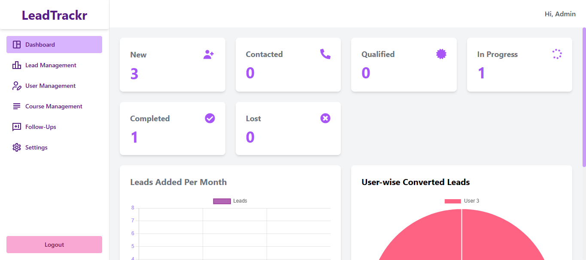
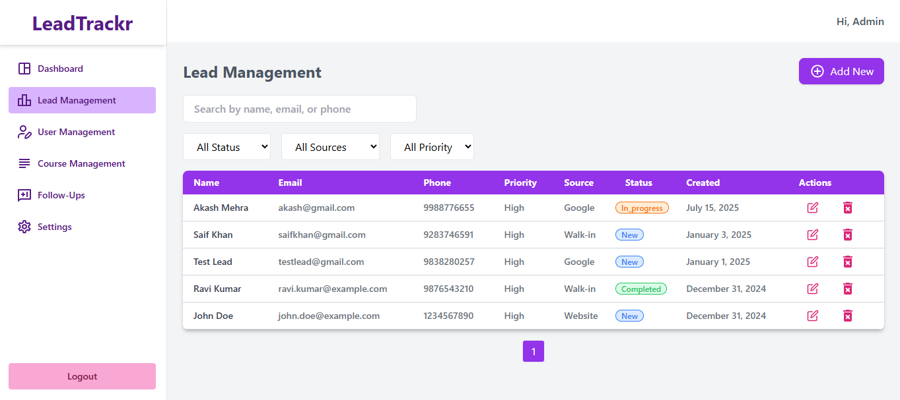
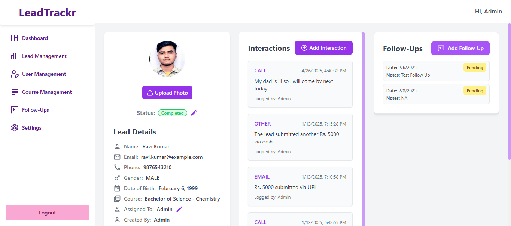

# LeadTrackr

**LeadTrackr** is a full-stack lead tracking and management system built to help institutions efficiently track, assign, and monitor leads. It provides a centralized dashboard to manage daily activities, routes, and conversion performance.

[Click here to open the app](https://leadtrackr.onrender.com/) (right-click to open in new tab)

## Features

- Lead creation, assignment, and status tracking
- Role-based access for Admins and Marketers
- Analytics dashboard (conversion rates, lead sources, etc.)
- JWT-based Authentication
- Follow Up Mechanism

## Tech Stack

**Client:** React, Typescript, TailwindCSS, React-hook-form

**Server:** Express, Typescript

**Database:** PostgreSQL with Prisma ORM

**State Management:** React Context

**Package Manager:** npm

## Screenshot

### Admin Dashboard



### Leads Table Page



### Leads Details Page



## Installation

1. Clone the repository:

```bash
git clone https://github.com/Zaeden/LeadTrackr.git
```

2. Navigate into the backend folder and install dependencies:

```bash
cd server
npm install
```

3. Navigate into the frontend folder and install dependencies:

```bash
cd ../client
npm install
```

4. Set up environment variables for backend:

```bash
PORT = 8000
DATABASE_URL = <postgresql-url>
JWT_SECRET_KEY = <your-jwt-secret>
COOKIE_MAX_AGE = <cookie-max-age>
CLOUDINARY_CLOUD_NAME = <your-cloudinary-cloud-name>
CLOUDINARY_API_KEY = <your-cloudinary-api-key>
CLOUDINARY_API_SECRET = <your-cloudinary-api-secret>
```

## Deployment

**Frontend + Backend:** Render.com
**Database:** NeonDB

To build this project on render

```bash
cd client && npm install && npm run build && cd ../server && npm run build
```

To run this project on render

```bash
npm start
```
